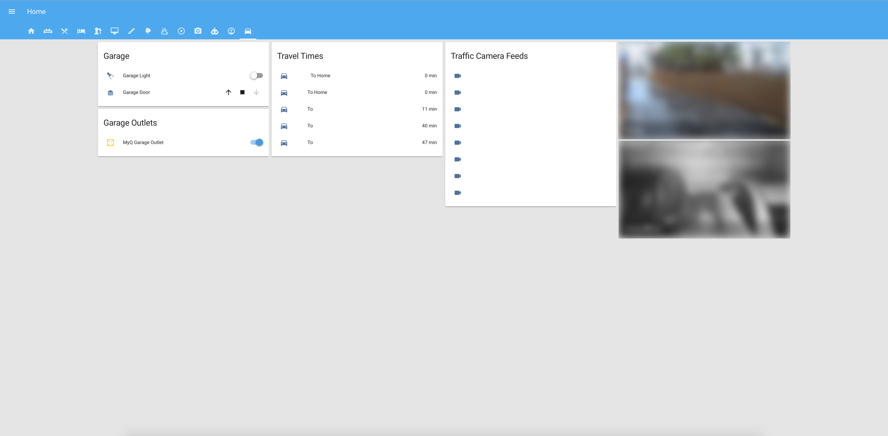

# Home Assistant
Example [Home Assistant](https://home-assistant.io) Configs

Home Assistant Version: 0.69.0

# Devices

## Hubs

| Device  | Quantity | Connection | Home Assistant | Notes |
| ------------- | :---: | ------------- | ------------- | ------------- |
| [Hue Hub v2](https://amzn.to/2IpNA3G) | 1 | Ethernet | [Philips Hue](https://www.home-assistant.io/components/hue/) | Used to control all Zigbee smart bulbs |
| [Wink Hub v1](https://amzn.to/2wMUjis) | 1 | Wi-Fi | [Wink](https://www.home-assistant.io/components/wink/) | Used as a dumb hub to connect Z-Wave and Lutron devices. No Wink Robots or schedules being utilized|

## Lighting

| Device  | Quantity | Connection | Home Assistant | Notes |
| ------------- | :---: | ------------- | ------------- | ------------- |
| [Philips Hue White and Color Ambiance](https://amzn.to/2Ip8waU) | 6 | Ethernet | [Philips Hue Light](https://www.home-assistant.io/components/light.hue/) | Color changing smart bulbs|
| [Philips Hue White and Color Ambiance LightStrip Plus Dimmable](https://amzn.to/2Kx27qF) | 1 | Hue Hub (Zigbee)| [Philips Hue Light](https://www.home-assistant.io/components/light.hue/) | Color changing smart led strip. Used as accent lighting|
| [Philips Hue White](https://amzn.to/2LaUFTd) | 7 | Hue Hub (Zigbee)| [Philips Hue Light](https://www.home-assistant.io/components/light.hue/) | Non color changing smart bulbs|
| [Cree Connected](https://amzn.to/2IpKAnZ) | 12 | Hue Hub (Zigbee)| [Philips Hue Light](https://www.home-assistant.io/components/light.hue/) | Non color changing smart bulbs|
| [Lutron Caseta Wireless Dimmer](https://amzn.to/2KwDJWc) | 8 | Wink Hub (Z-Wave)| [Wink Light](https://www.home-assistant.io/components/light.wink/) | Smart dimmer switches that do not require a neutral wire|

## Climate

| Device  | Quantity | Connection | Home Assistant | Notes |
| ------------- | :---: | ------------- | ------------- | ------------- |
| [Ecobee 3](https://amzn.to/2L72d9A) | 1 | Wi-Fi | [ecobee](https://www.home-assistant.io/components/ecobee/) / [Ecobee Thermostat](https://www.home-assistant.io/components/climate.ecobee/) | Used as primary thermostat |
| [Ecobee Room Sensor](https://amzn.to/2L9cORm) | 9 | Ecobee3 | [Ecobee Binary Sensor](https://www.home-assistant.io/components/binary_sensor.ecobee/) | Provides room temperature and room occupancy.|
| [Quirky + GE Aros Smart Window Air Conditioner](https://amzn.to/2ImtdEi) | 1 | Wi-Fi | [Wink Climate](https://www.home-assistant.io/components/climate.wink/) | Used to augment cooling on 2nd floor|
| [Frigidaire Cool Connect Smart Portable Air Conditioner](https://amzn.to/2k7kszE) | 1 | Wi-Fi | [Harmony Hub Remote](https://www.home-assistant.io/components/remote.harmony/) | Used to augment cooling on 2nd floor|

## Outlets

| Device  | Quantity | Connection | Notes |
| ------------- | :---: | :---: | ------------- |
| [Wemo Mini Smart Plug](https://amzn.to/2wQ05jE) | 4 | Wi-Fi | Smart outlets utilized to control various devices via powering the outlet on/off (fans, etc) |
| [GE Z-Wave Wireless Smart Lighting Control Outdoor Module](https://amzn.to/2KuFRxN) | 2 | Wink Hub (Z-Wave)| Used to control low voltage outdoor lighting transformers |
| [TP-Link Smart Plug HS100](https://amzn.to/2L5Bt9r) | 1 | Wi-Fi | Smart outlet used to control power to MyQ Device|
| [iHome WiFI Smart Plug](https://amzn.to/2rReF4z) | 2 | Wink Hub (Wi-Fi) | Smart Outlets. Not using these anymore due to overall poor reliability |

## Locks

| Device  | Quantity | Connection | Notes |
| ------------- | :---: | :---: | ------------- |
| [Schlage Connect Touchscreen Deadbolt](https://amzn.to/2KwXltd) | 3 | Wink Hub (Z-Wave) | Smart locks used in automations to auto lock / unlock doors |

## Security

| Device  | Quantity | Connection | Notes |
| ------------- | :---: | :---: | ------------- |
| [GoControl Door/Window Sensor](https://amzn.to/2wOhLfn) | 3 | Wink Hub (Z-Wave) | Door sensors to detect if exterior doors have been opened / closed |
| [GoControl Siren and Strobe](https://amzn.to/2k4bK4U) | 1 | Wink Hub (Z-Wave) | Alarm used for when alarm is triggered or when you want to get someone's attention|

## Voice Assistant

| Device  | Quantity | Connection | Notes |
| ------------- | :---: | :---: | ------------- |
| [Amazon Echo](https://amzn.to/2KuPHjd) | 1 | Wi-Fi | Audio only Voice Assistant, connected to Home Assistant via Emulated Hue |
| [Amazon Echo Dot](https://amzn.to/2wSreSW) | 6 | Wi-Fi | Audio only Voice Assistant, connected to Home Assistant via Emulated Hue |
| [Amazon Echo Spot](https://amzn.to/2rOVZ6a) | 1 | Wi-Fi | Voice Assistant with small display, connected to Home Assistant via Emulated Hue |
| [Amazon Echo Show](https://amzn.to/2rRhN0n) | 1 | Wi-Fi | Voice Assistant with display, connected to Home Assistant via Emulated Hue |

## Media

| Device  | Quantity | Connection | Notes |
| ------------- | :---: | :---: | ------------- |
| [Apple TV 4k](https://www.amazon.com/Apple-MQD22LL-A-TV-4K/dp/B075NCMLYL/ref=sr_1_2?ie=UTF8&qid=1526581374&sr=8-2&keywords=Apple+TV) | 2 | Wi-Fi | Used for media playback on 4k TVs |
| [Apple TV 4](https://www.amazon.com/Apple-TV-32GB-4th-Generation/dp/B075NFX24M/ref=sr_1_1?s=electronics&ie=UTF8&qid=1526581435&sr=1-1&keywords=Apple+TV) | 2 | Wi-Fi | Used for media playback on TVs |
| [Sonos Play:1](https://amzn.to/2IrsIor) | 10 | Wi-Fi | Audio playback and Home Assistant TTS |
| [Sonos Connect](https://amzn.to/2wSsup8) | 1 | Ethernet | Audio playback and Home Assistant TTS. Connects Sonos to existing surround sound system |
| [Sonos Connect:AMP](https://amzn.to/2rQ0XzM) | 1 | Wi-Fi | Audio playback and Home Assistant TTS. Connects Sonos to outdoor speakers |
| [Logitech Harmony Hub](https://amzn.to/2IuEvlS) | 3 | Wi-Fi | Controls various AV equipment and other devices that utilize infrared remotes |
| [Plex Media Server](https://plex.tv) | 1 | Ethernet | Media Server|  

* [Remotec Zwave Dry Contact Fixture Module](https://www.amazon.com/gp/product/B00913ATFI/ref=oh_aui_detailpage_o00_s00?ie=UTF8&psc=1) - *Gas Fireplace Control* - x1 (connected via Wink Hub)
* [Aeon Labs Water Sensor](https://www.amazon.com/gp/product/B00H3TJ3P4/ref=oh_aui_detailpage_o00_s00?ie=UTF8&psc=1) - x2 (connected via Wink Hub)
* [Foscam FI9800P](http://www.amazon.com/Wireless-Foscam-FI9800P-Waterproof-Detection/dp/B0173Z3NG2?ie=UTF8&psc=1&redirect=true&ref_=oh_aui_detailpage_o02_s01) - x1
* [Chamberlain MYQ](http://www.amazon.com/Chamberlain-MYQ-G0201-MyQ-Garage-Controls-Smartphone/dp/B00EAD65UW) - x1
* [Ring Doorbell](http://www.amazon.com/Ring-Wi-Fi-Enabled-Video-Doorbell/dp/B00TZAO9D0/ref=sr_1_4?ie=UTF8&qid=1461377085&sr=8-4&keywords=ring+doorbell) - x1
* [Wink Relay](http://www.wink.com/products/wink-relay-touchscreen-controller/) - x2
* [iRobot Roomba 980](https://www.amazon.com/iRobot-Roomba-Robot-Vacuum-Connectivity/dp/B013E9L4ZS/ref=sr_1_3?ie=UTF8&qid=1510543522&sr=8-3&keywords=roomba+980&dpID=51FYAIctNNL&preST=_SY300_QL70_&dpSrc=srch) - x1
* [iRobot Roomba 650](https://www.amazon.com/iRobot-Roomba-650-Robot-Vacuum/dp/B008LX6OC6/ref=sr_1_3?ie=UTF8&qid=1511129827&sr=8-3&keywords=roomba+660&dpID=519S5LhxhkL&preST=_SY300_QL70_&dpSrc=srch) - x1 (Not Automated)
* [Ubiquiti Unifi Security Gateway](https://www.amazon.com/Ubiquiti-Unifi-Security-Gateway-USG/dp/B00LV8YZLK/ref=sr_1_5?s=electronics&ie=UTF8&qid=1501612028&sr=1-5&keywords=unifi) - x1
* [Ubiquiti UniFi Switch - 24 Ports](https://www.amazon.com/Ubiquiti-UniFi-Switch-Managed-US-24-250W/dp/B00OJZUQ24/ref=pd_sbs_147_1?_encoding=UTF8&pd_rd_i=B00OJZUQ24&pd_rd_r=Y91CYDQDH8YKZCGFK62R&pd_rd_w=b1TBc&pd_rd_wg=RWi2l&psc=1&refRID=Y91CYDQDH8YKZCGFK62R) - x1
* [Ubiquiti UniFi Switch - 8 Ports](https://www.amazon.com/Ubiquiti-Networks-Managed-Gigabit-US-8-150W/dp/B01DKXT4CI/ref=sr_1_2?ie=UTF8&qid=1503435496&sr=8-2&keywords=unifi+8+port+switch) - x1
* [Ubiquiti Networks Unifi AC PRO](https://www.amazon.com/Ubiquiti-Networks-802-11ac-Dual-Radio-UAP-AC-PRO-US/dp/B015PRO512/ref=sr_1_1?ie=UTF8&qid=1501612450&sr=8-1&keywords=unifi+ap) - x3
* [Ubiquiti Networks Unifi AC LR](https://www.amazon.com/Ubiquiti-Networks-802-11ac-Dual-Radio-UAP-AC-PRO-US/dp/B015PRCBBI/ref=sr_1_1?ie=UTF8&qid=1501612450&sr=8-1&keywords=unifi%2Bap&th=1) - x1
* [Ubiquiti Unifi Cloud Key](https://www.amazon.com/Ubiquiti-Unifi-Cloud-Key-Control/dp/B017T2QB22/ref=sr_1_1?s=electronics&ie=UTF8&qid=1501612546&sr=1-1&keywords=unifi+cloud+key) - x1
* [Ubiquiti UVC-G3 UniFi Video Camera](https://www.amazon.com/Ubiquiti-UVC-G3-UniFi-Video-Camera/dp/B01EZYTYLC/ref=sr_1_1?s=electronics&ie=UTF8&qid=1503435626&sr=1-1&keywords=unifi+camera) - x2
* [Ubiquiti airGateway LR](https://www.amazon.com/gp/product/B00HXT84UO/ref=oh_aui_detailpage_o00_s00?ie=UTF8&psc=1) - x1 (used to connect UVC-G3 Wireless)
* [QNAP TS-453 Pro](https://www.amazon.com/gp/product/B00MEVUL6G/ref=oh_aui_search_detailpage?ie=UTF8&th=1) - x1
* [iOS App](https://home-assistant.io/ecosystem/ios/) (iOS Device Tracking)
* [Locative App](https://my.locative.io) (iOS Device Tracking)
* [Plex Media Server](https://plex.tv)
* [Homebridge](https://github.com/nfarina/homebridge) (Apple HomeKit Support)

# Interface

