# Home Assistant
Example [Home Assistant](https://home-assistant.io) Configs

Home Assistant Version: 0.40.1

# Devices

* [Ecobee 3](http://www.amazon.com/ecobee3-Smarter-Thermostat-Remote-Generation/dp/B00ZIRV39M/ref=sr_1_1?ie=UTF8&qid=1461377268&sr=8-1&keywords=ecobee3) + 9 Sensors
* [Hue Hub](http://www.amazon.com/Philips-458489-Hue-Bridge-Frustration/dp/B014H2P42K/ref=sr_1_1?ie=UTF8&qid=1461377320&sr=8-1&keywords=hue+hub)
* [Wink Hub](http://www.amazon.com/Wink-PWHUB-WH17-Connected-Home-Hub/dp/B00PV6GAI4/ref=sr_1_1?ie=UTF8&qid=1461377299&sr=8-1&keywords=wink+hub)
* [Hue Color](http://www.amazon.com/Philips-456186-Ambiance-Extension-Generation/dp/B014H2OZJS/ref=sr_1_1?ie=UTF8&qid=1461377356&sr=8-1&keywords=hue+color) - x6 (connected via Hue Hub)
* [Hue White](http://www.amazon.com/Philips-455295-White-Equivalent-Single/dp/B01C5C9ZLK/ref=sr_1_1?ie=UTF8&qid=1461377384&sr=8-1&keywords=hue+white) - x7 (connected via Hue Hub)
* [Hue Lightstrip Plus](https://www.amazon.com/dp/B0167H33DU/ref=twister_B01M8JU79M?_encoding=UTF8&psc=1) - x1 (connected via Hue Hub)
* [Cree Connected](http://www.amazon.com/dp/B01701DKVM/ref=twister_B017DJNMU0?_encoding=UTF8&psc=1) - x12 (connected via Hue Hub)
* [Lutron Caseta Wireless Dimmer](http://www.amazon.com/Lutron-PD-6WCL-WH-Caseta-Wireless-150-Watt/dp/B00KLAXFQA/ref=sr_1_4?s=hi&ie=UTF8&qid=1461376977&sr=1-4&keywords=caseta+wireless) - x8 (connected via Wink Hub)
* [Schlage Connect](https://www.amazon.com/Schlage-Connect-BE469NX-Touchscreen-Deadbolt/dp/B00AGK9KUU/ref=sr_1_3?ie=UTF8&qid=1482945181&sr=8-3&keywords=schlage%2Bconnect&th=1) - x3 (connected via Wink Hub)
* [GoControl Z-Wave Home Security Suite](http://www.amazon.com/GOCONTROL-WNK01-311KIT-Premium-Z-Wave-Security/dp/B00XUXYT6K/ref=sr_1_1?ie=UTF8&qid=1465167435&sr=8-1&keywords=go+control) - x1 (connected via Wink Hub)
* [GE Z-Wave Wireless Lighting Control Outdoor Module](https://www.amazon.com/GE-Wireless-Lighting-Control-Outdoor/dp/B0013V8K3O/ref=sr_1_1?ie=UTF8&qid=1466468235&sr=8-1&keywords=ge+outdoor+zwave) - x2 (connected via Wink Hub)
* [iHome WiFI Smart Plug](https://www.amazon.com/iHome-Smart-Apple-HomeKit-Amazon/dp/B010ACFEI0/ref=sr_1_1?ie=UTF8&qid=1467576017&sr=8-1&keywords=ihome+smart+plug) - x2 (connected via Wink Hub)
* [Remotec Zwave Dry Contact Fixture Module](https://www.amazon.com/gp/product/B00913ATFI/ref=oh_aui_detailpage_o00_s00?ie=UTF8&psc=1) - *Gas Fireplace Control* - x1 (connected via Wink Hub)
* [Aeon Labs Water Sensor](https://www.amazon.com/gp/product/B00H3TJ3P4/ref=oh_aui_detailpage_o00_s00?ie=UTF8&psc=1) - x2 (connected via Wink Hub)
* [Foscam FI9800P](http://www.amazon.com/Wireless-Foscam-FI9800P-Waterproof-Detection/dp/B0173Z3NG2?ie=UTF8&psc=1&redirect=true&ref_=oh_aui_detailpage_o02_s01) - x1
* [Chamberlain MYQ](http://www.amazon.com/Chamberlain-MYQ-G0201-MyQ-Garage-Controls-Smartphone/dp/B00EAD65UW) - x1
* [Ring Doorbell](http://www.amazon.com/Ring-Wi-Fi-Enabled-Video-Doorbell/dp/B00TZAO9D0/ref=sr_1_4?ie=UTF8&qid=1461377085&sr=8-4&keywords=ring+doorbell) - x1
* [Wink Relay](http://www.wink.com/products/wink-relay-touchscreen-controller/) - x2
* [Quirky + GE Aros Window AC](http://www.amazon.com/Quirky-Aros-Smart-Window-Conditioner/dp/B00IDXGIAC?ie=UTF8&psc=1&redirect=true&ref_=oh_aui_detailpage_o03_s01) -x1
* [Asus RT-AC88U Router](http://www.amazon.com/Dual-Band-Wireless-AC3100-Gigabit-Router-RT-AC88U/dp/B016EWKQAQ?ie=UTF8&psc=1&redirect=true&ref_=oh_aui_search_detailpage) (Device Tracking)
* [Amazon Echo](http://www.amazon.com/Amazon-SK705DI-Echo/dp/B00X4WHP5E/ref=sr_1_1?ie=UTF8&qid=1461377119&sr=8-1&keywords=amazon+echo) - x1 (via Emulated Hue)
* [Amazon Echo Dot](http://www.amazon.com/b/?node=14047587011) - x6 (via Emulated Hue)
* [Sonos PLAY:1](https://www.amazon.com/Sonos-PLAY-Compact-Wireless-Streaming/dp/B00EWCUK1Q/ref=sr_1_1?s=aht&ie=UTF8&qid=1480883246&sr=1-1&keywords=Sonos+play+1) - x8
* [Sonos CONNECT](https://www.amazon.com/Sonos-Wireless-Receiver-Component-Streaming/dp/B001CROHX6/ref=sr_1_3?s=aht&ie=UTF8&qid=1480883287&sr=1-3&keywords=Sonos+Connect) - x1
* [Harmony Hub](https://www.amazon.com/Logitech-Harmony-Companion-Control-Entertainment/dp/B00N3RFC4G/ref=sr_1_2?s=aht&ie=UTF8&qid=1479756420&sr=1-2&keywords=harmony+hub) - x1
* [iOS App](https://home-assistant.io/ecosystem/ios/) (iOS Device Tracking)
* [Locative App](https://my.locative.io) (iOS Device Tracking)
* [Plex Media Server](https://plex.tv)
* [Homebridge](https://github.com/nfarina/homebridge) *for Apple HomeKit Support*

# Interface
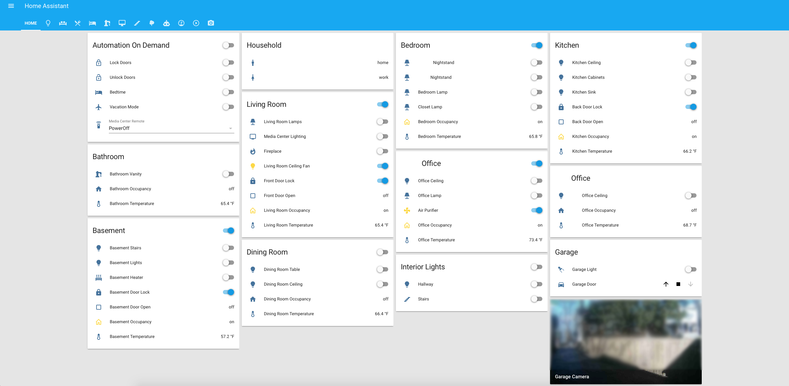
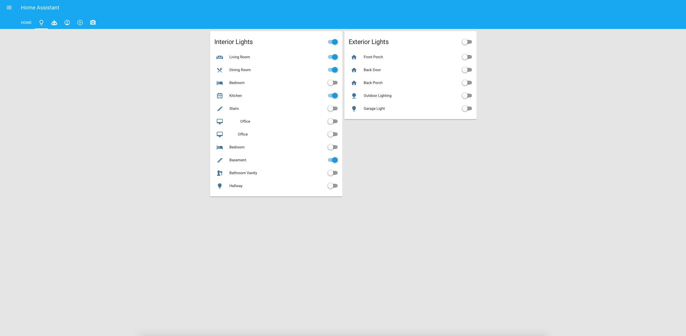
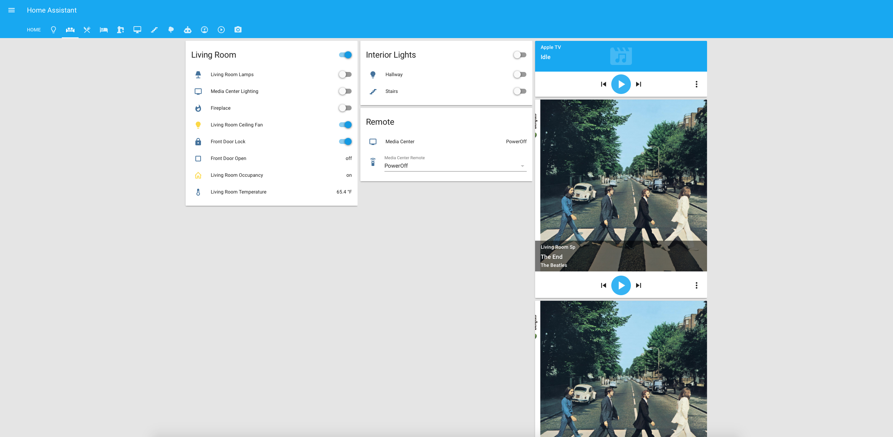
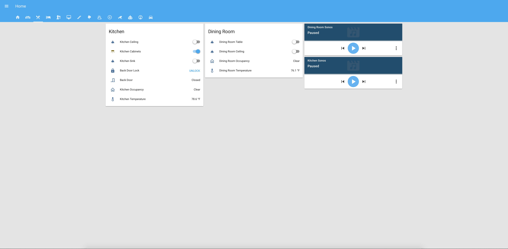

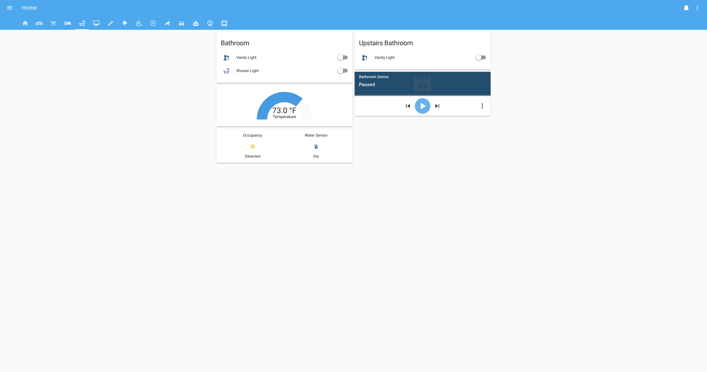
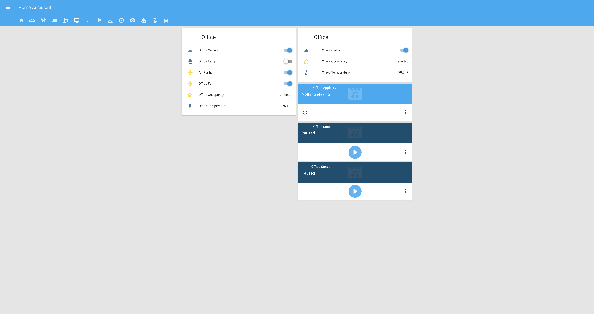
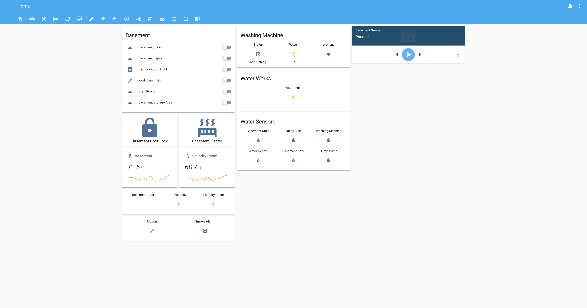
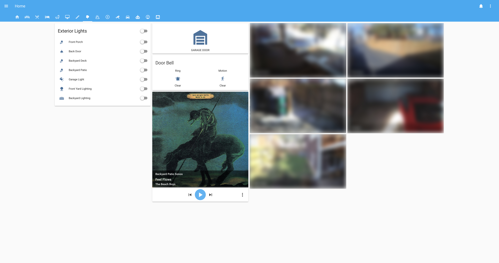
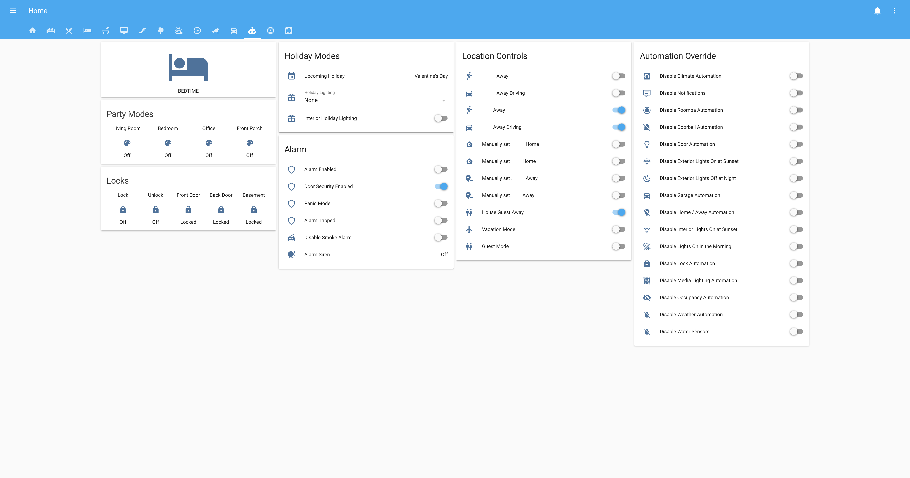
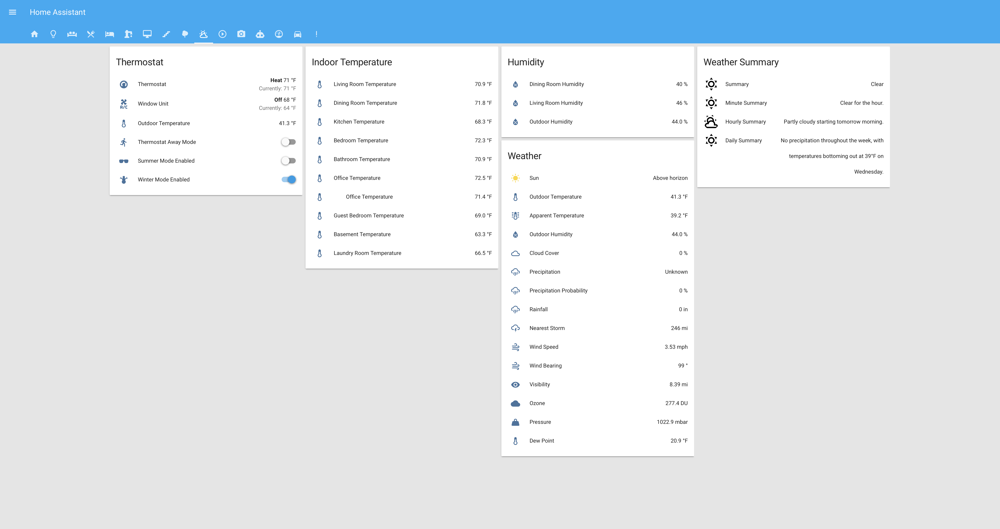

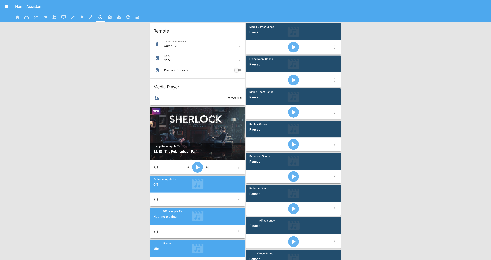
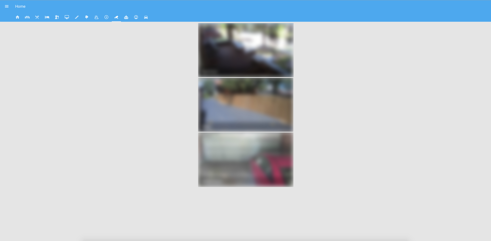
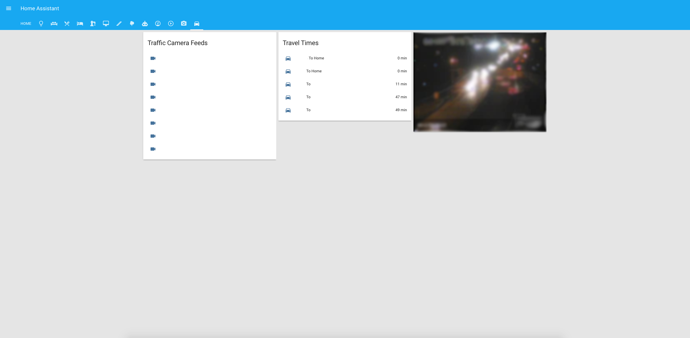

